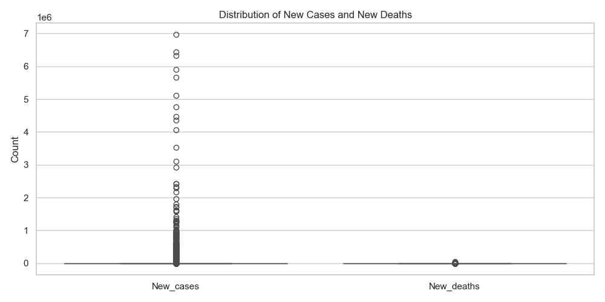
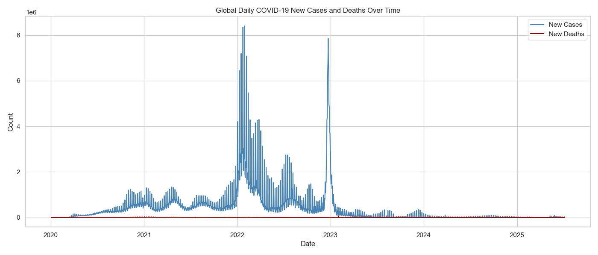
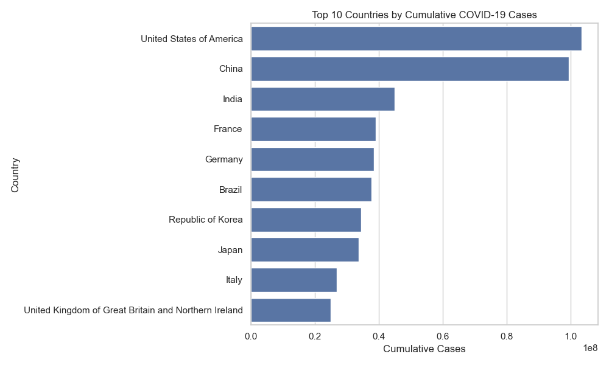

# CAPSTONE PROJECT
### NAMES: MUSHIMIYUMUKIZA BLAISE
### ID:26229
### Course: Introduction to Big Data
### LECTURER: MANIRAGUHA ERIC  
# 🌍 Global COVID-19 Analytics using WHO Data

## 🧠 Problem Statement

Can we analyze global trends and forecast the spread of COVID-19 using WHO daily reports to inform health policies and detect regional patterns?

---

## 🔧 Tools & Technologies

- **Python**: Pandas, Prophet, Scikit-learn, Matplotlib
- **Power BI**: Dashboard design & DAX
- **GitHub**: Project hosting and documentation

---

## 📊 Python Analysis

- Cleaned WHO global COVID-19 daily data
- Conducted EDA:
  - Daily trends, country-wise breakdown, top regions
- **Modeling**:
  - K-Means clustering by country based on case/death severity
  - Prophet time-series forecasting of new global cases

---

## 📈 Power BI Dashboard

- Summary cards (Total Cases, Deaths, Daily Trends)
- Interactive slicers by date, country, and region
- Time series and map visualizations
- Exported as `.pbix` for sharing and reuse

---

## 📌 Dataset

- **Source**: [WHO COVID-19 Data](https://srhdpeuwpubsa.blob.core.windows.net/whdh/COVID/WHO-COVID-19-global-daily-data.csv)
- **Format**: Structured CSV
- **Rows**: 482,640 | **Columns**: 8
- Includes country, region, new/cumulative cases and deaths

---

## 🔮 Key Findings

- Identified clear temporal and regional patterns
- Clustered countries into risk levels using unsupervised learning
- Forecasted new cases with strong time-series models

---

## 🧠 Author Info

- 👤 Name: *Blaise 26229*
- 🏫 Course: INSY 8413 – Introduction to Big Data Analytics
- 📅 Semester: Academic Year 2024-2025, Semester III
- 📧 Email: *Mushimiyumukiza Blaise*

---

> “Whatever you do, work at it with all your heart.” — *Colossians 3:23*
